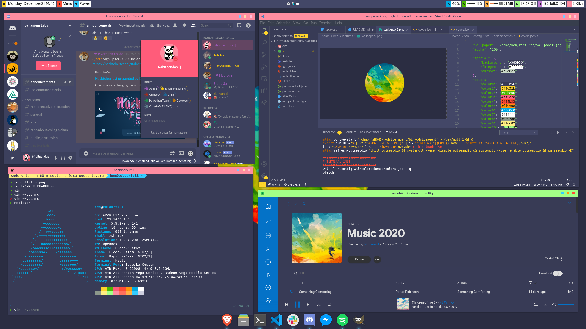

# Ben's Linux Dotfiles

###### Preface updated 01/2024

From 2018-2022, I used Linux as a primary OS. This repository is an archive of every custom install I've done durin that time, and should contain enough information to replicate any of them.

These days, I care a lot less about my desktop setup since I SSH into my [home server](https://devlog.bencuan.me) instead of developing locally.

I still think Linux customization is a lot of fun, and encourage you to try it out if you have an old laptop and a day off! There's something magical about transforming a generic text-only interface into your own unique creation with just a few commands.

## Latest

**[Colorfull (2020)](../../tree/colorfull)**
 - Distro: Arch Linux
 - Desktop Environment: Openbox
 - Terminal: kitty
 - Editor: vim, vscode

## History
Please navigate to a different branch to view specific instructions on how to install the dotfiles!

#### Branch List
 - [Colorfull](../../tree/colorfull): A boxy pastel-colored Openbox rice
 - [SummerSkyRedux](../../tree/summersky-redux): A graphical overhaul of the SummerSky config, with a new color scheme
 - [SummerSky](../../tree/summersky): Vanilla Arch Qtile rice
 - [Manjaro-Summer](../../tree/manjaro-summer): A Manjaro Openbox rice with custom wallpaper
 - [Openbox-Winter](../../tree/openbox-winter): A cleaner, more customized spiritual successor to Openbox-OSX
 - [Openbox-OSX](../../tree/openbox-osx): A vanilla Arch-based Openbox rice inspired by MacOS
 - [Openbox](../../tree/openbox)
 - [bspwm](../../tree/bspwm)

## Contributing Guide (mostly for myself)
1. Fork if necessary, then create a new branch from master.
2. Delete this README and rename `EXAMPLE_README.md` to `README.md`.
3. Edit the new README to include all necessary details and screenshots for your configuration. The goal is to make it easy for any user to reproduce your exact setup by simply following instructions.
4. Upload your dotfiles! Remember to include any configs that are outside of `~/.config` and any special instructions for installing them. Also remove any files from `.config` that are not unique to your config (e.g. spotify, vscode, discord...)
5. Add your branch to the directory in the master README.

