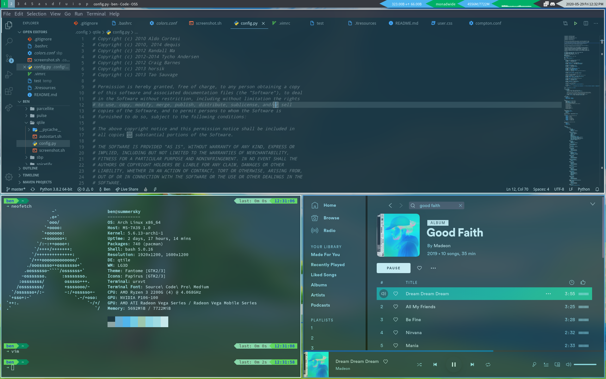

# 64bitpanda's dotfiles: colorfull

A departure from my past ricing trends: away with the blurs, rounded corners, and subtle blues; in with boxiness and bright colors! 

<!-- REMEMBER TO EDIT THIS!!! -->

 - **OS:** Arch Linux
 - **DE:** [Openbox](https://wiki.archlinux.org/index.php/openbox)
 - **GTK Theme:** A custom version of [owl4ce's Fleon](https://github.com/owl4ce/dotfiles)
 - **Greeter:** [Aether](https://github.com/NoiSek/Aether)
 - **Compositor:** [picom](https://github.com/tryone144/compton)
 - **Fonts:** Google Sans with [elenapan's](https://github.com/elenapan/dotfiles) custom Iosevka
 - **Terminal:** [kitty](https://github.com/kovidgoyal/kitty/) with zsh
 - **File Manager:** Thunar
 - **Bar:** Polybar with custom version of [adi1090x polybar-8](https://github.com/adi1090x/polybar-themes#-polybar-8)
 - **Icon Theme:** [Papirus-Dark](https://github.com/PapirusDevelopmentTeam/papirus-icon-theme)

## Recommended Base
Follow the steps in the [Arch Linux installation guide](https://wiki.archlinux.org/index.php/installation_guide) to make sure the pre-install is good to go!

## Keyboard Shortcuts
I have Super mapped to the Windows key on my keyboard.

| **Applications**           	|                    	|
|-------------------------	|--------------------	|
| Super+Shift+S |  Take a screenshot |
| Super+F  |  File Manager (thunar)       	|
| Super+M  |  Spotify (with adblock)       	|
| Super+Enter  	|  Terminal (kitty)     	|
| Super+W             	|  Close window       	|
| Super+Space           	|  rofi application menu    	|
| Super+X           	|  play/pause spotify   	|

| **Power Management**        	|                    	|
|-------------------------	|--------------------	|
| Super+L                 	| Lock               	|
| Super+Shift+L             | Suspend              	|

## What's Included

Here's an inexhaustive list of my modifications:

### zsh
I use `oh-my-zsh` with `powerlevel10k` and `zsh-autosuggestions`. 

### Vim
My vimrc is a modified version of [Ultimate Vimrc](https://github.com/amix/vimrc).

### Spotify
My Spotify config uses [Spicetify](https://github.com/khanhas/spicetify-cli) for custom theming. For colors, I use wal-defined system colors, and for custom CSS I use a modified version of [DribbblishDynamic](https://github.com/morpheusthewhite/spicetify-themes/tree/master/DribbblishDynamic). All Spotify configs can be found in `.config/spicetify`.

### Color Scheme
The color scheme can be found in `.config/wal/colorschemes/colors.json`. Here it is in table form:

| **Colors**        	|                    	|
|-------------------------	|--------------------	|
|                 	| #383b56              	|
|                 	| #434767              	|
|                 	| #ffd52b              	|
|                 	| #ffee82              	|
|                 	| #49b800              	|
|                 	| #a3ff87              	|
|                 	| #ff5c7a              	|
|                 	| #ff8da1              	|
|                 	| #ff4b33              	|
|                 	| #ff6f5c              	|
|                 	| #ff950a              	|
|                 	| #ffaf47              	|
|                 	| #00a8e0              	|
|                 	| #33ccff              	|
|                 	| #ffffff              	|
|                 	| #cecfdf              	|
|                 	| #8c978b              	|
|                 	| #8c978b              	|

## Installation Guide

### Part 1. Base Install
 1. Download Arch Linux [here](https://www.archlinux.org/download/).
 2. Use a disk imaging tool (like Rufus) to create a live USB. MAKE SURE IT IS ON DD MODE!!!!! (or use the `dd` command)
 3. Get openbox: `sudo pacman -S openbox`

### Part 2. Getting the Essentials
 1. Get yay: `git clone https://aur.archlinux.org/yay.git`, then `cd yay` then  `makepkg -si`
 2. Update packages: `yay -Syyu`
 3. If necessary, customize grub order using `grub-customizer` and set EFI boot order using `efibootmgr` and `efibootmgr -o #1,#2,#3......` (If this doesn't work, the BIOS might be overriding it. Check the settings there)

### Part 3. Basic Ricing/Desktop Necessities
 1. Grab opensnap for snappy windows
 3. Grab `plank`
 5. [Get color emojis](https://www.reddit.com/r/linux/comments/ao0mp3/how_to_better_enable_color_emojis/)
 6. Set default terminal to `kitty`
 7. Get wal: `sudo pip3 install pywal`

### Part 4. Lightdm Configuration
 1. Get `lightdm-webkit2-greeter` and `lightdm-webkit-theme-aether`
 2. Set avatar: `Append Icon=/path/to/your/avatar.png to the bottom of the file at /var/lib/AccountsService/users/<youraccountname>`. Also change the profile directory in `/etc/lightdm/lightdm-webkit2-greeter.conf`. If none of these work, then replace the `avatar-background.png` in `/usr/share/lightdm-webkit/themes/lightdm-webkit-theme-aether/src/img/`.
 3. Set wallpaper: Edit the files located in `/usr/share/lightdm-webkit/themes/lightdm-webkit-theme-aether/src/img/wallpapers/`.
 4. Set Aether theme settings by going into the settings panel- hover near the bottom left corner to access.

### Part 5. GTK/Openbox Themes
 1. Make sure the themes are present in `~/.themes`.
 2. Set theme and fonts using `lxappearance`.

### Part 6. Pywal and Color Schemes
 1. Set color scheme and wallpaper: `wal -i path/to/image.png -b "#260422 -a 50` (extra parameters are for blur, adjust accordingly)
 2. Add `wal -R` to .bashrc and .zshrc
 3. Run `nitrogen` and set the wallpaper to the same one from the `wal` command
 4. Get [vscode-wal](https://github.com/Bluedrack28/vscode-wal) and follow the instructions for vscode color schemes

### Part 7. Installing the config files
 1. Clone the repository. `git clone https://github.com/64bitpandas/dotfiles`
 1. Run `cd dotfiles` then `git checkout colorfull`.
 1. Move the files into your `$HOME` directory.
 1. Set the themes using `lxappearance` (Fantome with Papirus icons).
 1. Enjoy the beautiful desktop :D

