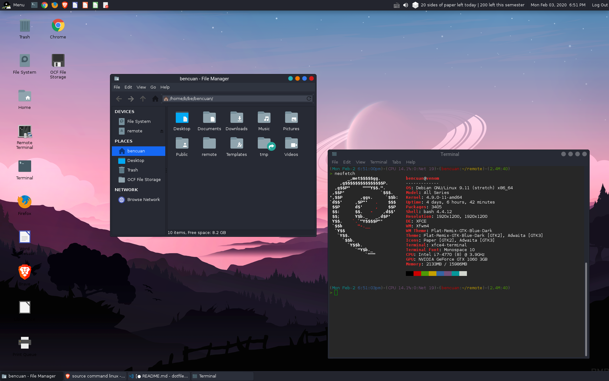

# 64bitpanda's dotfiles: SummerSky

Summer 2020 Qtile rice. Work in progress!

<!-- REMEMBER TO EDIT THIS!!! -->

 - **OS:** Arch Linux
 - **DE:** [Qtile](http://www.qtile.org/)
 - **GTK Theme:** [Fantome](https://github.com/addy-dclxv/gtk-theme-collections)
 - **Greeter:** [Aether](https://github.com/NoiSek/Aether)
 - **Compositor:** [Compton with Tryone's Kawase Blur Patch](https://github.com/tryone144/compton)
 - **Bar:** Polybar (coming soon)
 - **Wallpaper:** [Drawn by myself :D](https://bencuan.me)

## Recommended Base
Follow the steps in the [Arch Linux installation guide](https://wiki.archlinux.org/index.php/installation_guide) to make sure the pre-install is good to go!

## Keyboard Shortcuts
I have Super mapped to the Windows key on my keyboard.

 |  **Desktops and Windows**   	|                    	|
|-------------------------	|--------------------	|
| Super+J/K |  Cycle window focus	|
| Super+Ctrl+J/K  |  Move window left/right	|
| Super+Tab   |  Cycle window layout	|
| Super+W   |  Close window	|
| Super+I/M | Increase/Decrease window size
| Super+1/2/3/4/5 | Switch to desktop
| Super+Shift+1/2/3/4/5 | Send window to desktop |

| **Applications**           	|                    	|
|-------------------------	|--------------------	|
| Super+Shift+S |  Take a screenshot |
| Super+F  |  File Manager (thunar)       	|
| Super+Enter  	|  Terminal (urxvt)     	|
| Super+G             	|  Firefox       	|
| Super+C             	|  vscode (code)      	|
| Super+Space           	|  dmenu    	|

| **Power Management**        	|                    	|
|-------------------------	|--------------------	|
| Super+L                 	| Lock               	|
| Super+Shift+L             | Suspend              	|

## What's Included

Here's an inexhaustive list of my modifications:

### Compton
My config file is at `.config/compton.conf`. The main change I made is to set custom window opacities based on the window name. If you would like to add more blurry windows, use `xprop` to discover the window name or class and add it to the `opacity-rule` list.

### Qtile
**Layouts:** I've enabled three layouts, but you can easily change this in `.config/qtile/config.py`. Press Super-Tab to switch between layouts.
 - **Max:** Standard fullscreen layout where only one window will show at a time. Press Super+J/K to cycle windows.
 - **MonadTall:** One large window on the left half of the screen; all the other windows are equally sized on the right half.
 - **MonadTall:** One large window on the top half of the screen; all the other windows are equally sized on the bottom half.

**Autostart:** Scripts that run on startup are found in `.config/qtile/autostart.sh`.

**Windows:** I've switched away from the default asdfuiop scheme in favor of number keys (12345). Press Super-(number) to switch to that desktop, or Super-Shift-(number) to send the current tab to that desktop.

### Bash
On startup, bash runs `pfetch` and refreshes the wal color scheme. Pressing the up arrow will use history completion rather than the default behavior. The font I use is IBM Plex Mono. (TODO)

### Vim
My vimrc is a modified version of [Ultimate Vimrc](https://github.com/amix/vimrc). (TODO)

### Firefox
For Firefox, I use [this CSS mod](https://github.com/datguypiko/Firefox-Mod) along with [Humble new tab page](https://addons.mozilla.org/en-US/firefox/addon/humble-new-tab/) and [this tab page theme](https://github.com/akshat46/FlyingFox).

### Spotify
My Spotify config uses [Spicetify](https://github.com/khanhas/spicetify-cli) for custom theming. For colors, I use wal-defined system colors, and for custom CSS I use a modified version of [Gradianto](https://github.com/morpheusthewhite/spicetify-themes/tree/master/Gradianto).

### Aether
To be added later!
### Polybar
To be added later!

## Installation Guide

### Part 1. Base Install
 1. Download Arch Linux [here](https://www.archlinux.org/download/).
 2. Use a disk imaging tool (like Rufus) to create a live USB. MAKE SURE IT IS ON DD MODE!!!!! (or use the `dd` command)

### Part 2. Getting the Essentials
 1. Get yay: `git clone https://aur.archlinux.org/yay.git`, then `cd yay` then  `makepkg -si`
 2. Update packages: `yay -Syyu`
 3. Basic programs: `visual-studio-code-bin`. `discord`, `jdk8`, `rxvt-unicode`, `python-pip`, `nodejs`, `npm`, `adobe-source-code-pro-fonts`, `ttf-material-icons-git`
 4. If necessary, customize grub order using `grub-customizer` and set EFI boot order using `efibootmgr` and `efibootmgr -o #1,#2,#3......` (If this doesn't work, the BIOS might be overriding it. Check the settings there)

### Part 3. Basic Ricing/Desktop Necessities
 1. Grab opensnap for snappy windows
 2. Rounded corners patch: `openbox-patched`
 3. Blur patch: `compton-tryone-git`
 3. Grab `plank`
 5. [Get color emojis](https://www.reddit.com/r/linux/comments/ao0mp3/how_to_better_enable_color_emojis/)
 6. Set default terminal to `urxvt`
 7. Get wal: `sudo pip3 install pywal`
 8. Set cursors: `paper-gtk-theme-git` 
 9. Set terminal in thunar: `urxvt -cd %f`

### Part 4. Lightdm Configuration
 1. Get `lightdm-webkit2-greeter` and `lightdm-webkit-theme-aether`
 2. Set avatar: `Append Icon=/path/to/your/avatar.png to the bottom of the file at /var/lib/AccountsService/users/<youraccountname>`. Also change the profile directory in `/etc/lightdm/lightdm-webkit2-greeter.conf`
 3. Set wallpaper: Edit the files located in `/usr/share/lightdm-webkit/themes/lightdm-webkit-theme-aether/src/img/wallpapers/`.
 4. Set Aether theme settings by going into the settings panel- hover near the bottom left corner to access.

### Part 5. GTK/Openbox Themes
 1. git clone https://github.com/addy-dclxv/gtk-theme-collections ~/.themes
 2. git clone https://github.com/addy-dclxvi/openbox-theme-collections ~/.themes
 2. Set theme and fonts using Manjaro appearance panel (press the Super key -> Settings -> Appearance)
 3. Set openbox themes using `obconf`

### Part 6. Pywal and Color Schemes
 1. Set color scheme and wallpaper: `wal -i path/to/image.png -b "#260422 -a 50` (extra parameters are for blur, adjust accordingly)
 2. Add `wal -R` to .bashrc and .zshrc
 3. Run `nitrogen` and set the wallpaper to the same one from the `wal` command
 4. Get [vscode-wal](https://github.com/Bluedrack28/vscode-wal) and follow the instructions for vscode color schemes

### Part 7. Installing the config files
 1. Clone the repository. `git clone https://github.com/64bitpandas/dotfiles`
 1. Run `cd dotfiles && git checkout manjaro-summer`
 1. Run a `cp -r` to copy `.config` to `~/`
 1. Copy .Xresources and .zshrc to `~/`
 1. Enjoy the beautiful desktop :D

### Part 8: Multilanguage Support
  1. Get `ibus`, `ibus-libpinyin`,  `adobe-source-han-sans-cn-fonts`
  3. Run `ibus-setup` to configure languages, then restart for it to take effect
